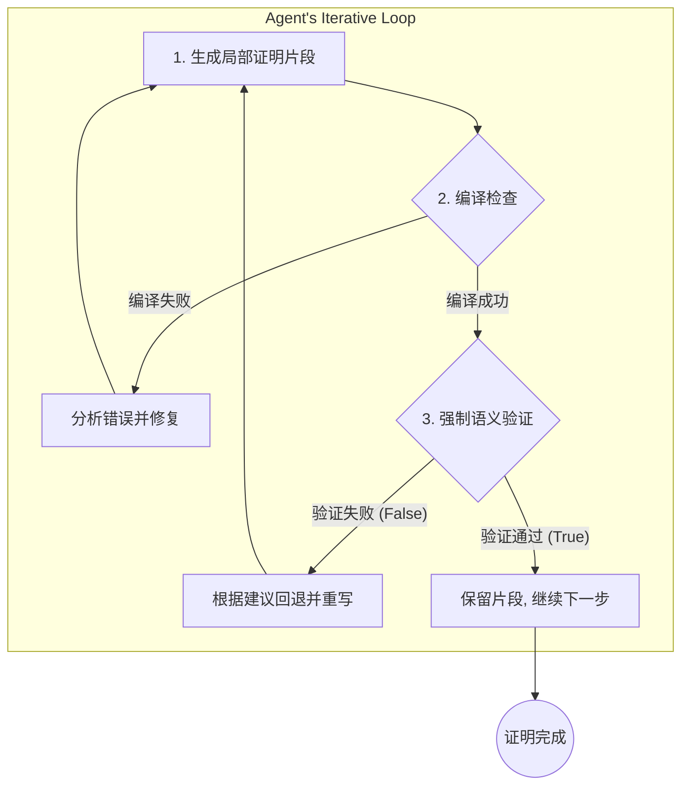

# lean4-auto-formalization
本项目旨在构建一个**可实践、可复现**的 Lean4 证明自动化流水线，核心在于将语义验证工具 `semantic_validator.py`（原名 `steps.py`）作为智能体（Agent）驱动流程中的强制性语义关卡，从而实现“生成—编译—验证”的自我修正闭环。

> 本章为新增高级应用部分，说明如何把 `semantic_validator.py` 嵌入到一个基于公开 Agent 插件的自动化证明生成工作流中。

---

## 项目亮点

- **强制语义验证**：编译通过不是终点，`semantic_validator.py` 做进一步的逻辑/语义一致性校验。
- **自我修正闭环**：Agent 以小步迭代生成证明片段，失败时根据验证器建议回退并重试。
- **门槛低、落地快**：设计目标包含降低 Lean4 标注门槛与落地成本，使非计算机/非数学专业参与标注成为可能。
- **使用市面常见公开 Agent 插件**：示例兼容主流工具链（如 LangChain、AutoGen、Guidance 等），便于集成与二次开发。

---

## 适用场景

- 自动化生成定理证明并保证证明语义正确。
- 构建人机协作的标注平台，允许非专业人员参与 proof annotation 的初步工作。
- 研发自我修正能力的 AI 辅助证明工具。

---

## 快速上手（示例）

1. 克隆仓库并安装依赖（示例）：

```bash
git clone <your-repo-url>
cd your-repo
# 安装 Python 依赖（示例）
python -m venv .venv
source .venv/bin/activate
pip install -r requirements.txt
```

2. 本地准备：确保本地使用的 `Mathlib` 库可用（项目要求使用本地库，不依赖外网）。

3. 直接运行语义验证器示例：

```bash
python src/semantic_validator.py \
  --name "problem_name_here" \
  --lean_dir "path/to/current/lean/files" \
  --ori_dir "path/to/reference/translations" \
  --json
```

---

## 高级应用：构建自动化证明生成代理（Agent）

`semantic_validator.py` 不只是检查器——它可以作为 Agent 的“批评家”，在生成-编译-验证闭环中提供决定性反馈。下面是设计要点与实现建议。

### 核心思想：生成—编译—验证的强制闭环

Agent 不再一次性生成整段证明，而是按小片段（例如单个 tactic 或 lemma）迭代生成并验证：



**要点**：
- 编译成功只保证语法与类型正确；
- 语义验证保证逻辑与思路与原问题一致；
- 验证失败时，生成的片段**必须**被丢弃并根据 `advice` 回退重写；
- 只有经过语义验证的片段才会被固化。

### Agent 行为准则（建议实现）

1. **顺序处理**：一次专注一个 `.lean` 文件；文件完全通过前不开始下一个文件。
2. **片段化生成**：产生小而可验证的证明片段以降低错误成本。
3. **强制调用验证器**：每次编译成功后必须调用 `semantic_validator.py` 进行语义检查（见示例调用）。
4. **基于反馈的行动**：
   - 若 `{"ok": true, ...}` 则固化片段并继续；
   - 若 `{"ok": false, ...}` 则依据 `advice` 回退并重试；
5. **严格依赖本地库**：禁止使用 `axiom`、`sorry`、`admit`、或外网查询；所有证明必须基于本地 `Mathlib`。
6. **最终验证**：当文件完整生成后，对整个 `.lean` 文件做一次最终的编译与语义验证。

---

## 推荐的公开 Agent 插件与集成建议（示例）

为降低二次开发成本并提高可维护性，推荐使用当前主流且文档完备的 Agent 框架进行集成：

- **LangChain**：良好的链式思维、工具调用与外部系统集成能力，适合作为总体 Orchestrator。
- **AutoGen**（或类似的多 agent 协作框架）：适合需要多角色（生成者、验证者、审阅者）协同的场景。
- **Guidance（Microsoft）**：在生成策略控制与约束方面有良好支持，便于细粒度约束生成过程。

> 说明：这里列举的是可直接使用的公开插件名称，最终集成可根据团队偏好与许可证选择具体实现。

---

## 伪代码：Agent 主控制流

下面为一个简化伪代码，描述 Agent 如何和 `semantic_validator.py` 协同工作：

```python
# 代理主循环的伪代码
from semantic_validator import validate_semantics

for problem in list_of_problems:
    current_lean_code = get_theorem_statement(problem)
    is_proof_complete = False

    while not is_proof_complete:
        # 1. 生成下一个证明片段
        new_fragment = agent.generate_next_proof_step(current_lean_code)

        # 尝试将新片段加入代码
        candidate_code = current_lean_code + new_fragment

        # 2. 编译检查
        compilation_ok, error_message = compile_lean(candidate_code)

        if not compilation_ok:
            agent.learn_from_compilation_error(error_message)
            continue

        # 3. 强制语义验证
        is_semantic_ok, report = validate_semantics(
            problem_name=problem['name'],
            lean_dir="path/to/current/work",
            ori_dir="path/to/reference_texts"
        )

        if is_semantic_ok:
            current_lean_code = candidate_code
            if check_if_proof_is_finished(current_lean_code):
                is_proof_complete = True
        else:
            agent.learn_from_semantic_advice(report['advice'])
            continue

    save_final_lean_file(problem['name'], current_lean_code)
    print(f"问题 {problem['name']} 已成功证明并验证！")
```

---

## 开发与贡献指南

- 请在本地准备好 `Mathlib` 并确保 `lean` 命令可用。
- 提交 PR 时请附带可复现的最小示例与测试用例。
- 如果要扩展 Agent 集成代码，请把第三方 Agent 适配层放在 `src/agents/` 目录下，并在 `docs/` 中补充使用示例。

---

## 常见问答（FAQ）

**Q：为什么需要语义验证器，而不是只看编译结果？**

A：编译只证明代码在语法与类型层面没有错误，但不保证证明思路、前提使用或命题理解与原始问题一致。语义验证器能检测语义偏差并给出可操作的 `advice`，从而使 Agent 具备自我纠错能力。

**Q：能否把验证器作为可选步骤用于加速？**

A：不推荐。若把验证器设为可选，会丧失闭环自我修正能力，生成结果的可靠性将显著下降。

---

## 许可与致谢

感谢所有参与讨论并验证 `semantic_validator.py` 设计思想的同学与合作者。


